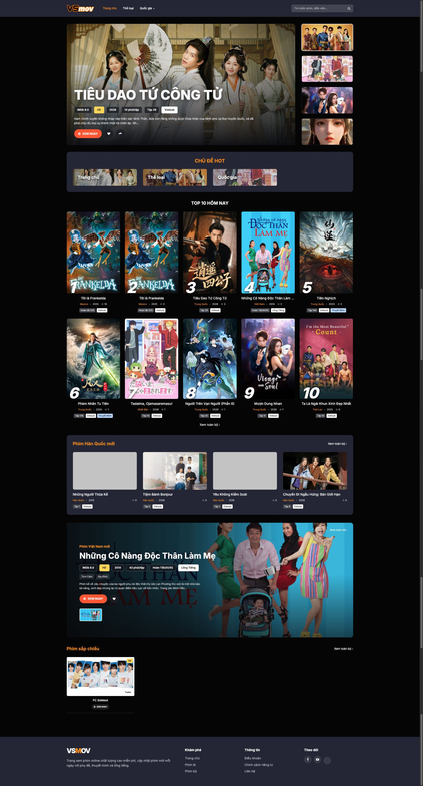
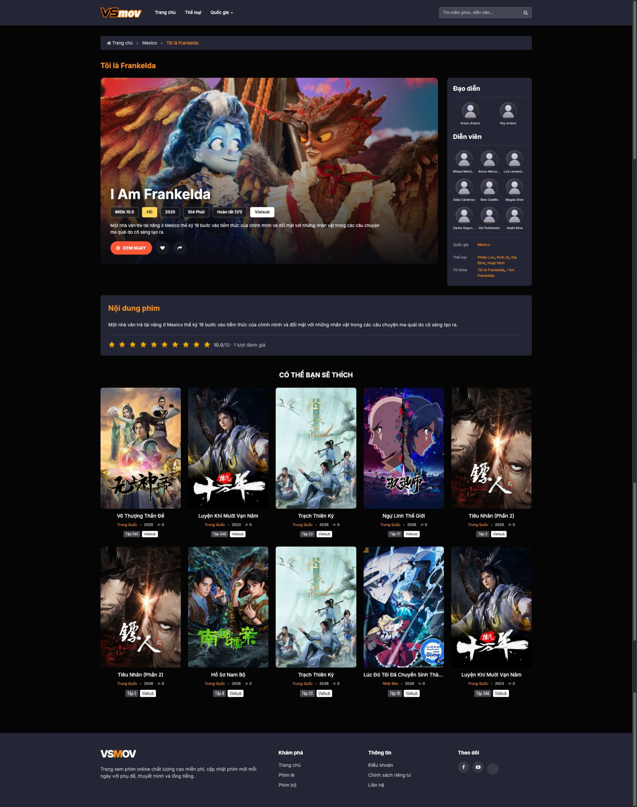
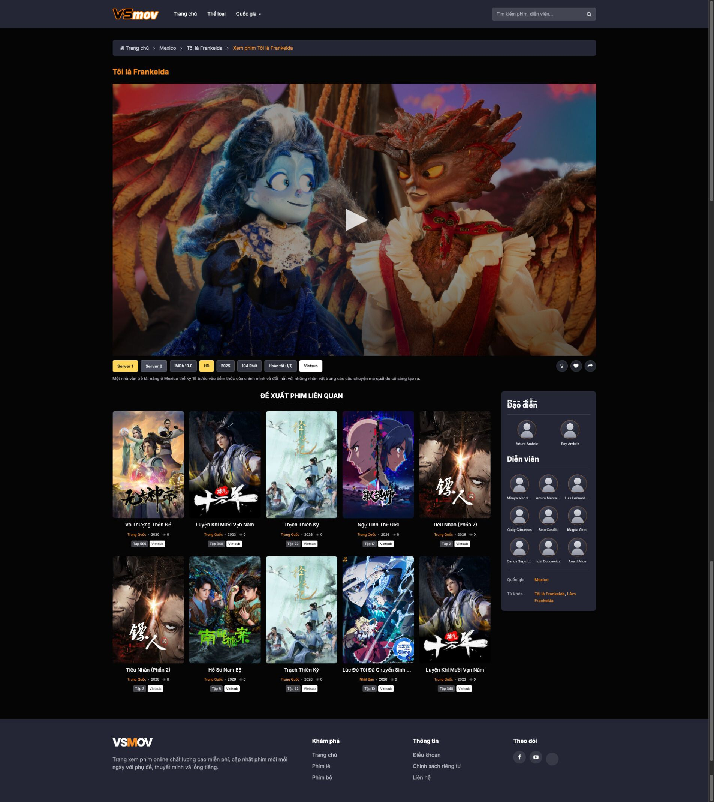

# VSMOV Theme Phim

Theme Laravel/Blade dành cho VSMOV CMS, triển khai theo thiết kế **Phim**.

## Màn hình

- Trang chủ: hero phim đề cử, chủ đề hot, top 10 và các danh sách phim động.
- Chuyên mục/tìm kiếm: breadcrumb, bộ lọc, lưới phim và phân trang.
- Chi tiết phim: hero, metadata, đạo diễn/diễn viên, tập mới, rating, phim liên quan.
- Xem phim: player, chọn server/tập, tắt đèn và phim liên quan.
- Responsive cho desktop, tablet và mobile.

## Ảnh giao diện

### Trang chủ



### Chi tiết phim



### Xem phim



## Yêu cầu

- Một dự án VSMOV CMS đang hoạt động.
- Laravel 6, 7 hoặc 8.
- Composer 2.

## Cài đặt bằng Composer

Chạy lệnh sau tại thư mục gốc của dự án VSMOV:

```bash
composer require vsmov/theme-phim:^1.0
```

Package hỗ trợ Laravel package auto-discovery nên không cần đăng ký service
provider thủ công. Tiếp theo, xuất asset của theme ra thư mục `public`:

```bash
php artisan vendor:publish --tag=phim-assets --force
php artisan optimize:clear
```

Sau khi cài đặt hoàn tất:

1. Đăng nhập Admin Panel.
2. Mở mục **Themes**.
3. Chọn **Phim · Figma** và kích hoạt.

## Cập nhật

Khi có phiên bản mới, chạy:

```bash
composer update vsmov/theme-phim --with-dependencies
php artisan vendor:publish --tag=phim-assets --force
php artisan optimize:clear
```

Lệnh publish có `--force` để thay thế asset cũ bằng asset của phiên bản vừa cập
nhật.

## Cấu hình trang chủ

Khối **Chủ đề hot** có trình chỉnh sửa riêng trong tab `List`: có thể đổi tiêu
đề khối, thêm/xóa/đổi thứ tự chủ đề và chỉnh tên, đường dẫn, ảnh nền. Khi ảnh nền
để trống, theme tự lấy poster trong danh sách phim đề cử.

Màn hình sửa theme hiển thị section builder để thêm, xóa, đổi thứ tự và chọn một
trong bốn kiểu trình bày. Dữ liệu vẫn được lưu tương thích với cấu hình cũ, mỗi
dòng có dạng:

```text
display_label|relation|find_by_field|value|limit|show_more_url|style|sort_field|sort_direction
```

Ví dụ:

```text
Top 10 hôm nay||||10|/|style1|view_day|desc
Phim Hàn Quốc mới|regions|slug|han-quoc|4|/quoc-gia/han-quoc|style2|updated_at|desc
Phim Việt Nam mới|regions|slug|viet-nam|5|/quoc-gia/viet-nam|style3|updated_at|desc
Phim sắp chiếu||status|trailer|4|/danh-sach/phim-sap-chieu|style4|publish_year|desc
```

- `style1`: top xếp hạng, poster dọc.
- `style2`: lưới thumbnail ngang trong panel.
- `style3`: banner phim nổi bật kèm danh sách thumbnail.
- `style4`: hàng phim sắp chiếu dạng gọn.

Cấu hình sáu cột cũ vẫn hoạt động và tự dùng `style2`.

## Tùy biến

- View gốc của package: `vendor/vsmov/theme-phim/resources/views/themephim`
- Thư mục ghi đè view trong dự án: `resources/views/vendor/themes/themephim`
- Asset đã publish: `public/themes/phim`

Không nên sửa trực tiếp file trong `vendor` vì các thay đổi sẽ bị ghi đè khi chạy
`composer update`.
